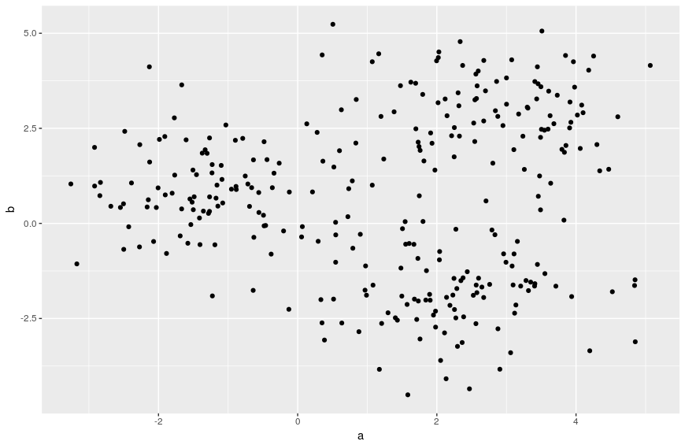
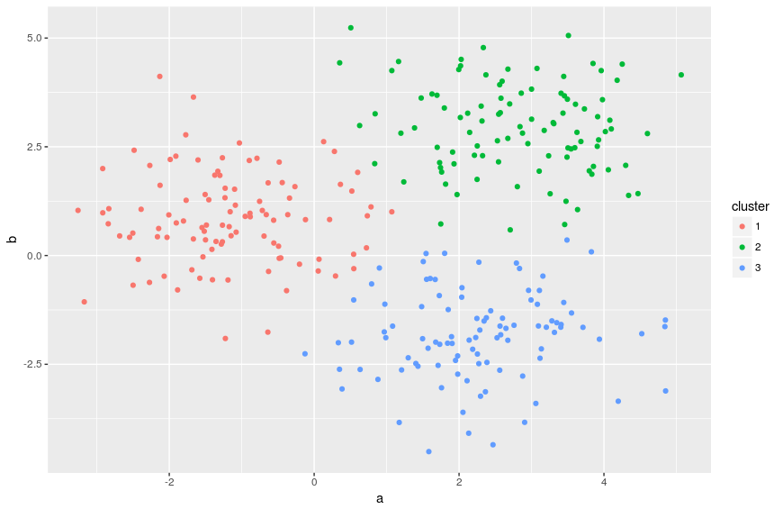
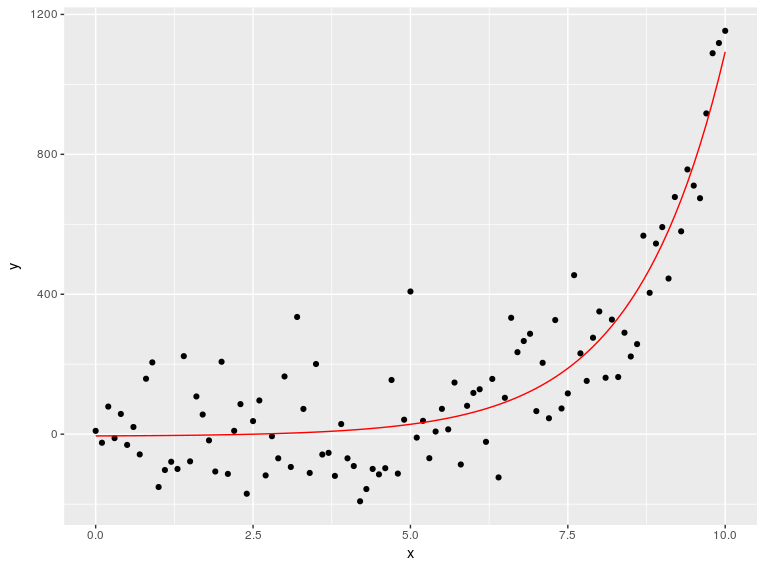
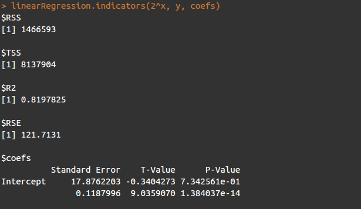

Here are some attempts of statistical learning algorithms implementation, just for learning purpose, and mainly inspired by the book "An Introduction to Statistical Learning".

## K-means clustering

## Multiple linear regression

